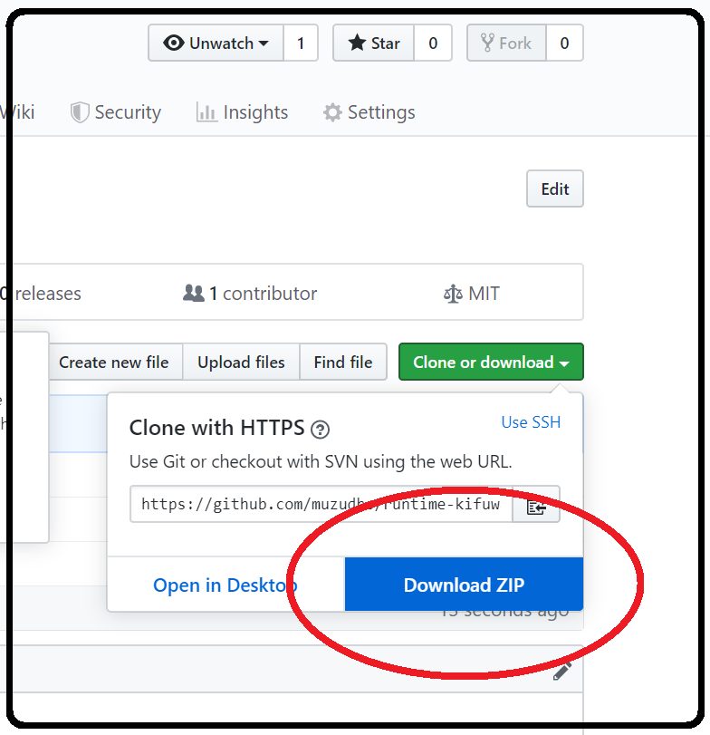
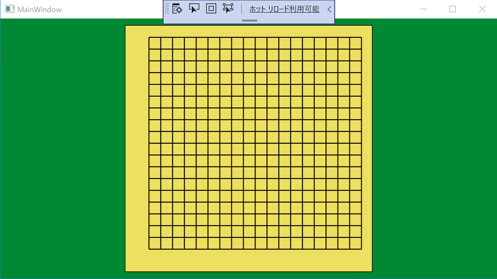

# runtime-kifuwarabe-go-board-gui
 とかいうボタンを押して持っていけだぜ☆（＾～＾） publish フォルダーの中に .exe が入ってるからダブルクリックしろだぜ☆（＾～＾）  

## Example

  

See: [script-4.txt](./doc/script/script-4.txt)  

**Be sure to open input.txt with Visual studio code.**  
You can open the file without locking it.  

Please copy and paste `script-4` to `input.txt`.  
input.txt is in the same directory as the .exe file. input.txt is automatically generated.  

## Open source

[kifuwarabe-go-board-gui](https://github.com/muzudho/kifuwarabe-go-board-gui)  

## See also

[ScreenToGif](https://www.screentogif.com/)  
アニメ画像作りたいとき便利☆（＾～＾） ウィンドウに吸着するし☆（＾～＾）  
